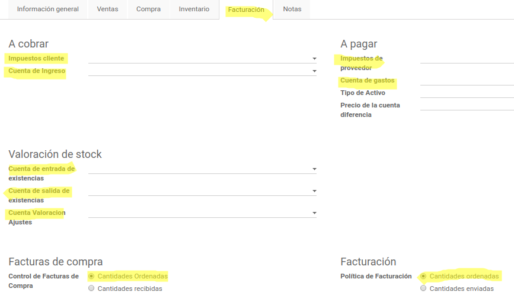

============================
Manual Creación de Catálogos
============================

El siguiente instructivo es direccionado a la creación de catálogos para trazabilidad de los diferentes módulos en Odoo.

Contactos
=========

1.1 Creación de Contactos
-------------------------

Para la creación de contactos ir a la siguiente dirección: 

:menuselection:`Módulo Contactos --> Contactos -->` y click en **Crear**

.. image:: media/imagen03.png
   :align: center

.. nota::
    Al crear se despliega una ventana con varias pestañas, tomar en cuenta que todos los campos marcados de color negro son obligatorios y deben ser llenados para guardar el contacto.

1.2 Contactos y Direcciones
---------------------------

Se registran contactos de referencia como de cobro, contabilidad, ventas etc.

   
1.3 Ventas y Compras
---------------------

Se registra información como si es cliente, proveedor, el comercial que está a cargo del contacto y cuentas bancarias.

.. image:: media/imagen06.png
   :align: center

1.4 Contabilidad
----------------

Se registra los plazos de pago tanto para facturas de venta como de compra, el tipo de contribuyente que servirá para las retenciones y las cuentas contables a cobrar y a pagar para el registro de facturas de venta y compras respectivamente.

Productos
=========

Para la creación de productos ir a la siguiente dirección: 

:menuselection:`Módulo Inventario --> Control de inventario --> Productos -->` click en **Crear** y click en **Guardar**

.. note::
    Al crear se despliega una ventana con varias pestañas, tomar en cuenta que todos los campos marcados de color negro son obligatorios y deben ser llenados para guardar el producto.

2.1 Información general
-----------------------

Se registra el tipo de producto (Almacenable, Servicio, Consumible), Categoría, referencia interna (Código del producto), Precio de venta, Costo, Unidad de medida, Marca.

2.2 Facturación
---------------

Se registra en general la cuentas contables con las cuales se van a realizar los asientos contables al igual que los impuestos que incurren en el producto.

2.3. Notas
----------

Descripción del producto para cada uno de los procesos

Cuentas Contables
=================

Creación de Cuentas
-------------------

Para la creación de cuentas ir a la siguiente dirección: 

:menuselection:`Módulo Facturación --> Configuración --> Plan Contable -->` click en **Crear** y click en **Guardar**

.. image:: media/imagen12.png
   :align: center

.. note::
    Al crear se despliega una ventana con varias pestañas, tomar en cuenta que todos los campos marcados de color negro son obligatorios y deben ser llenados para guardar la cuenta contable.

Se inicia registrando la estructura de balance (PYG / Balance), Categoría (Cuenta padre o de jerarquía), tipo de cuenta, nombre y código.

Diarios
=======

Para la creación de diarios ir a la siguiente dirección: 

:menuselection:`Módulo Facturación --> Configuración --> Diarios -->` click en **Crear** y click en **Guardar**

.. note::
    Al crear se despliega una ventana para ingresar información, tomar en cuenta que todos los campos marcados de color negro son obligatorios y deben ser llenados para guardar el diario.

Se registra el nombre del diario, tipo (ventas, compras, banco, efectivo), store (Bodegas en la cual se va realizar movimientos el diario), codigo, si es electrónico (emite documentos electrónicos).

Impuestos
=========

Para la creación de impuestos ir a la siguiente dirección:

:menuselection:`Módulo Facturación --> Configuración --> Impuestos -->` click en **Crear** y click en **Guardar**

.. note::
    Al crear se despliega una ventana para ingresar información, tomar en cuenta que todos los campos marcados de color negro son obligatorios y deben ser llenados para guardar el impuesto.

