=========
Ausencias
=========

El siguiente instructivo es direccionado a la configuración y manejo del módulo de Ausencias y sus integraciones con el Módulo de Empleados.

1. Configuración del tipo de Ausencias
=======================================

Para configurar, dirigirse a la siguiente dirección: 

:menuselection:`Módulo de Ausencias --> Pestaña --> Configuración --> Crear --> Ingresar los datos --> Guardar`

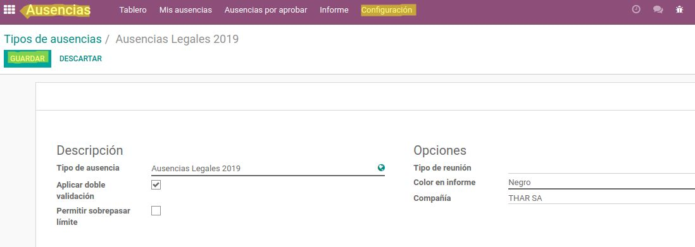

.. note:: 
    Agregar todas las que se van a utilizar.
    
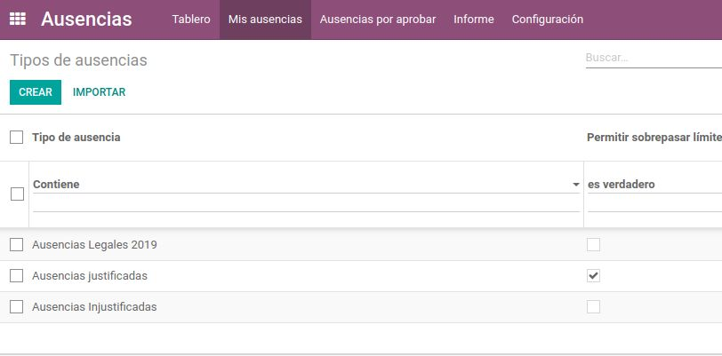

2. Crear Etiquetas en Empleados
===============================

Para crear etiquetas, dirigirse a la siguiente dirección:

:menuselection:`Módulo de Empleados --> Pestaña Empleados --> Seleccionar Empleado --> Editar --> En etiquetas añadir un elemento.`

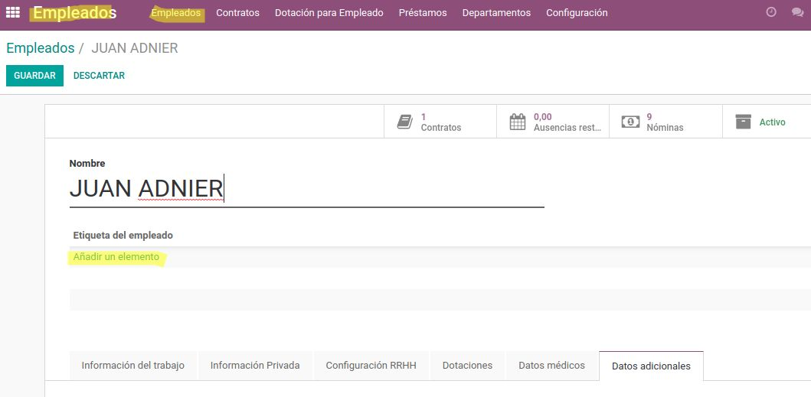

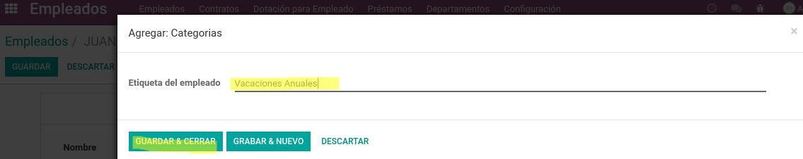

.. note:: 
    Agregar todas etiquetas a utilizar y ubicarlas en cada empleado
    
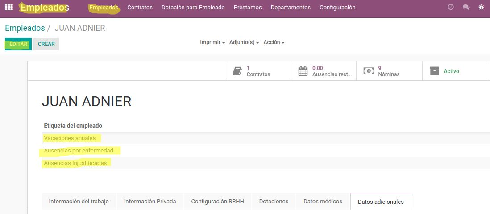

3. Asignar Ausencias
====================

Para asignar ausencias, dirigirse a la siguiente dirección:

:menuselection:`Módulo de Ausencias --> Pestaña Ausencias por aprobar --> Crear --> Ingresar información --> Guardar --> Aprobar`

(En el caso de doble Validación **Validar**).

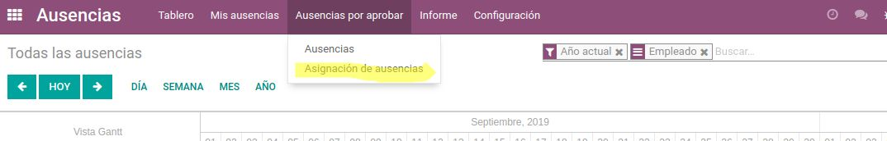

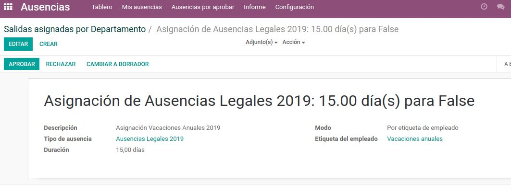

.. note:: 
    Agregar todas las que se van a utilizar.

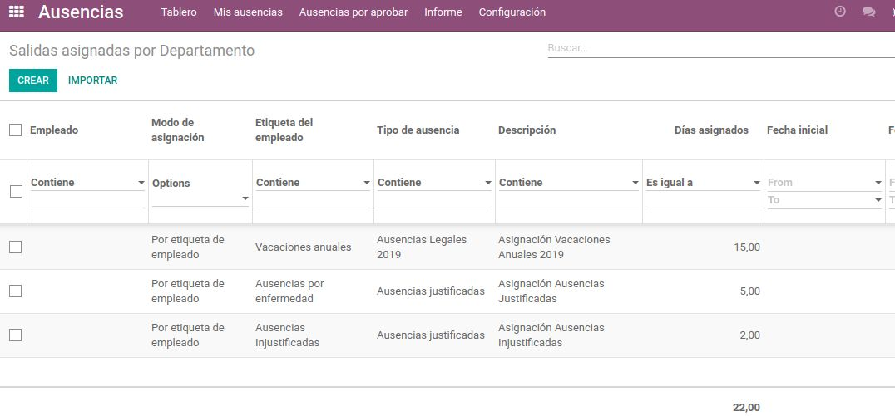

4. Solicitud de Ausencia
========================

Cada empleado al ingresar al sistema *Login* puede solicitar ausencias en la siguiente dirección: 

:menuselection:`Módulo de Ausencias --> Pestaña Mis ausencias --> Crear --> Ingresar información --> Guardar`

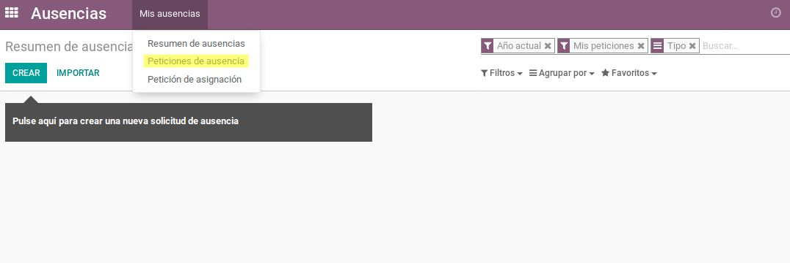
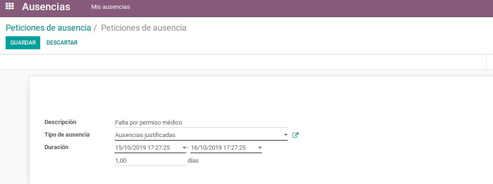
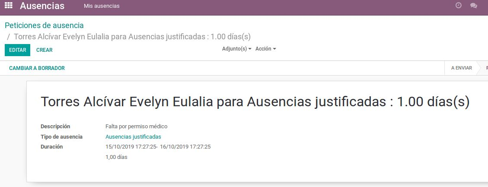

.. note::
    Al guardar automáticamente el sistema crea una solicitud por aprobar y aparecerá al gerente o administrador del módulo de Ausencias, el cual puede aprobar o rechazar dicha solicitud.

El administrador debe dirigirse a la siguiente dirección:  

:menuselection:`Módulo de Ausencias --> Pestaña Ausencias por aprobar --> Aprobar --> Rechazar`

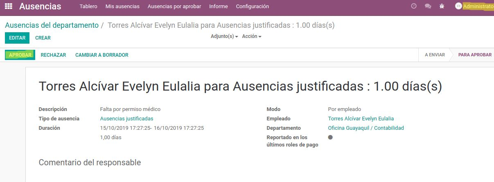