=================
Manual de Compras
=================

1. Cotización de Compra
=======================

Creación de Cotización
----------------------

Ir a: :menuselection:`Compras o Purchases --> Compra --> Solicitud de Presupuesto`

click en :menuselection:`Crear --> Guardar`

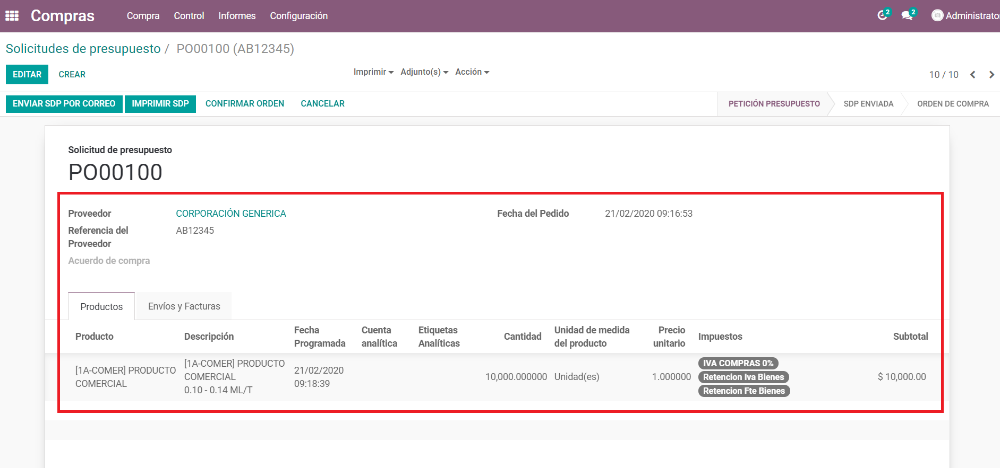

.. nota::
    Agregar Fecha Programada de Recepción y Bodega de Recepción **Enviar a**

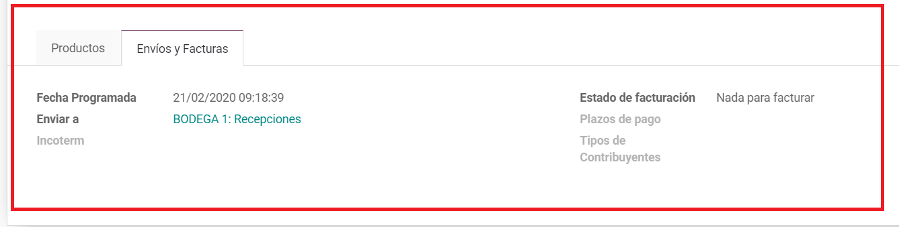

Pulsar: **Confirmar Orden**

.. nota::
    “En este punto, la cotización se a convertido en un Pedido de Compra“

2. Pedido de Compra
===================

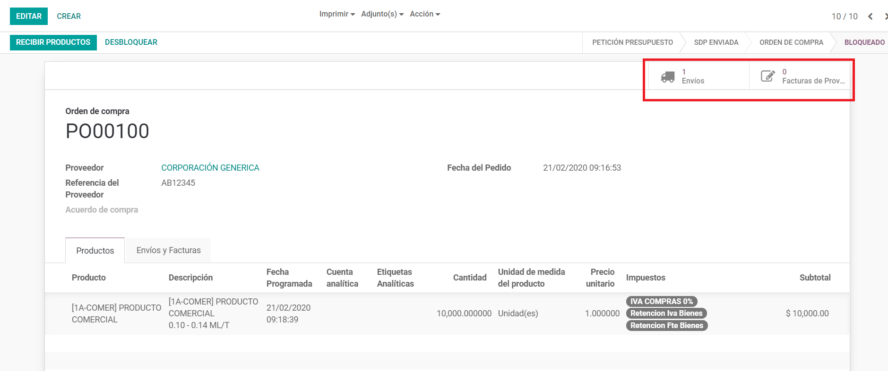

.. note::

   Desde el Pedido de Compra se accede a **“Envíos”** o Recepción de Inventario y a las **“Facturas de Proveedor”**

2.1 Recepcion de Inventario
---------------------------

Ir a: :menuselection:`Módulo de Inventario --> Recepciones --> Elegir Movimiento`
:menuselection:`--> Ingresar el lote y las cantidades  de la Recepción`   

Pulsar  **Confirmar**

Pulsar **Validar**

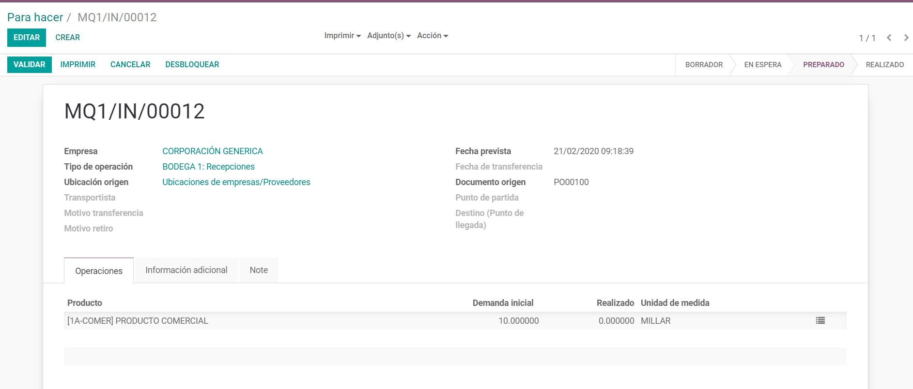
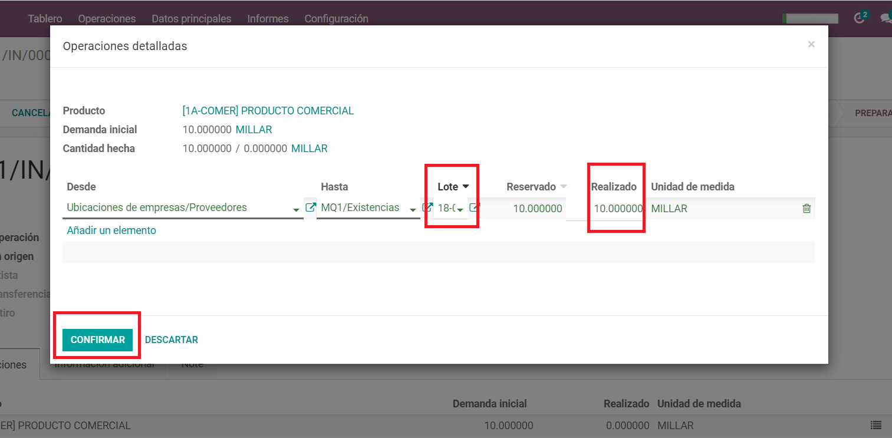

2.2 Factura de Compra
---------------------

Desde el pedido de compra ir a:

:menuselection:`Facturas de Proveedor --> Crear --> Ingresar los datos de la Factura`

Pulsar **Grabar**

Pulsar **Validar** 

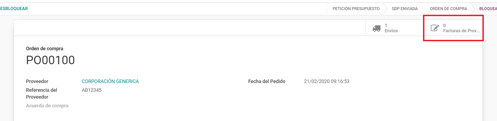
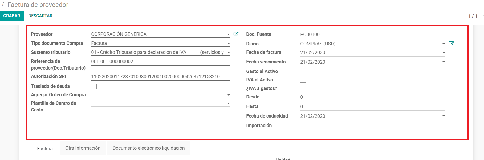

.. note::
    Dentro del registro de la factura de compra se restan los valores retenidos del valor a pagar de la factura, al **Validar** la factura de compra  se genera la Retención Electrónica, de acuerdo a la configuración del Producto y la Posición Fiscal del Proveedor

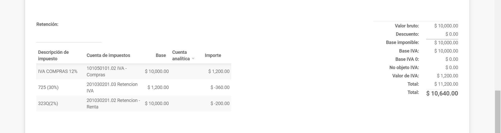

3. Registro del Pago
====================

- En la Factura pulsar en: **Registrar Pago** 

- Seleccionar el **Método de Pago** (previamente creado en Diarios)

- Ingresar los datos restantes 

- Validar

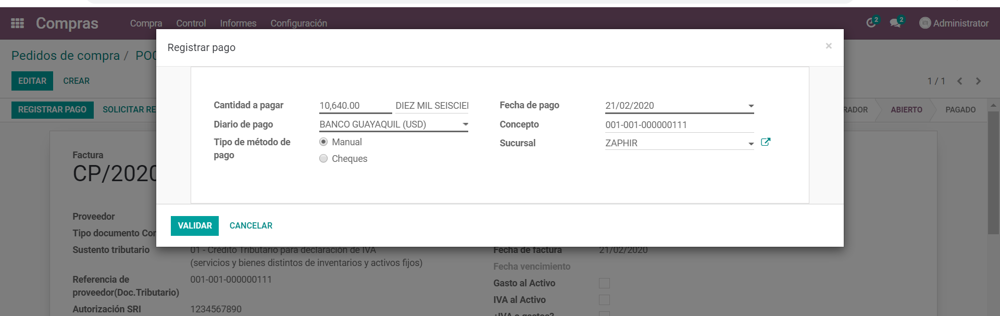

.. note::
    Se genera un Egreso automático  de acuerdo a la información del pago.
    
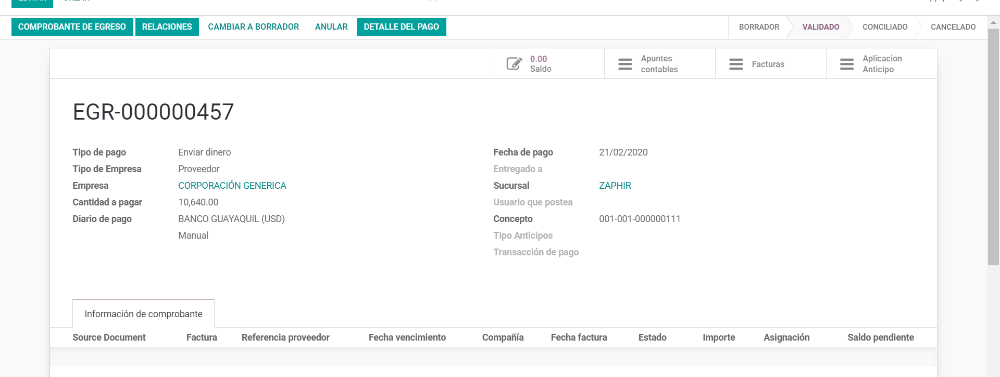

.. note:: Se cruza de forma automática el pago con la factura.

4. Nota De Crédito Por Reembolso En Compras
===========================================

4.1 Nota De Credito
-------------------

- Pulsar **Reembolso de Compras** 

- Seleccionar el **Método de Abono** (Crear un borrador de rectificativa)

- Escribir Motivo, Fecha de abono  

- Pulsar **Emitir Rectificativa** 

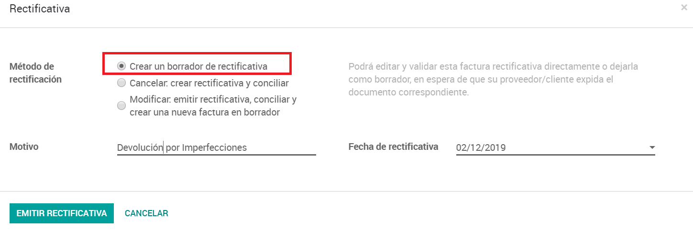

- Editar e ingresar  los datos de la nota de crédito

- Guardar

- Validar

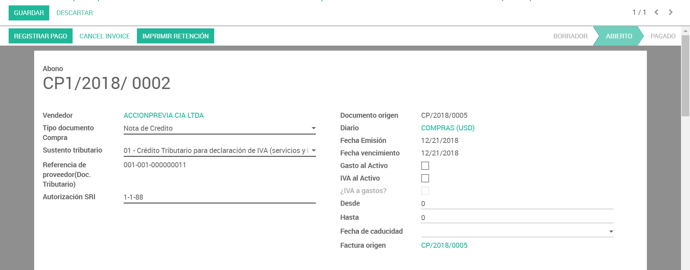
   
4.2 Cruzar Nota De Crédito Con Factura (Solo si es requerido)
-------------------------------------------------------------

- Ingresar en **Nota de Crédito** 

- Click sobre el  Proveedor

- Pulsar **Conciliar Pagos**

- Pulsar **+** sobre la factura y nota de crédito que se busca conciliar 

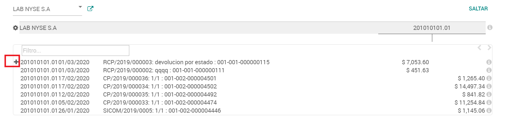

- Pulse **Conciliar**

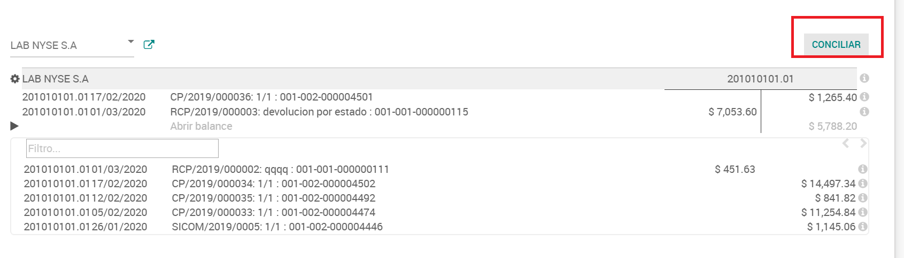

4.3 Devolucion De Stock
-----------------------

En la Orden de Compra 

- Ingresar al envío realizado

- Pulsar **Devolver**, Ingresar la cantidad regresada 

- Pulsar **Devolver**

- Se genera un nuevo documento de entrega

- Ingresar el lote y las cantidades de la Entrega

- Pulsar **Validar**

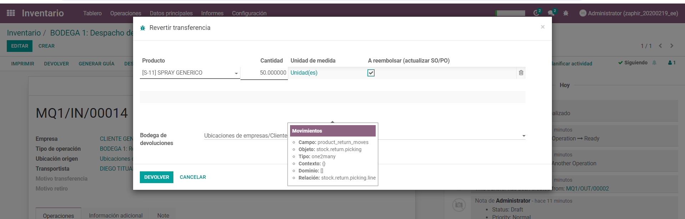

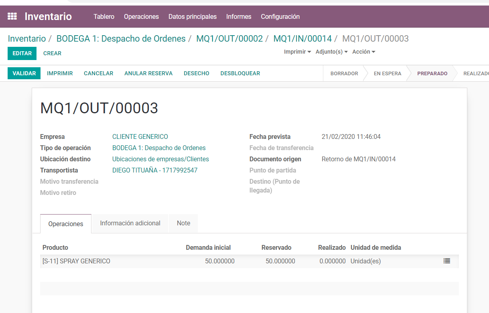

5. Nota  De Crédito Para Disminuir Deuda En Compras De Producto Almacenable (Cuando no se devolverá stock ya recibido)
======================================================================================================================

5.1 Nota De Credito
-------------------

En la Factura

- Pulsar **Reembolso de Compras** 

- Seleccionar el **Método de Abono** (Crear un borrador de rectificativa)

- Escribir Motivo , Fecha de abono  

- Pulsar **EMITIR RECTIFICATIVA** 

- Editar e ingresar  los datos de la nota de crédito

- Editar en la línea del producto la cuenta contable y agregar una de “descuento en compras” ,o como indique el responsable de contabilidad , ya que cuando se dan estos casos y se deja la Cuenta Puente de recepciones, esta va a quedar abierta en razón de que no se dará su contraparte al devolver el stock .

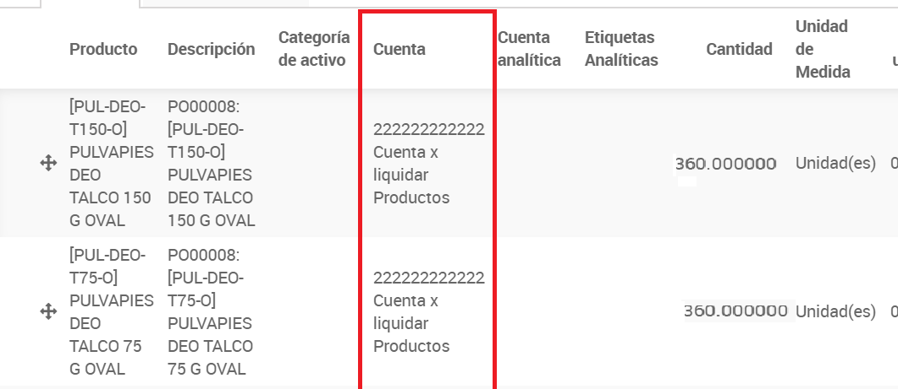

- Guardar

- Validar

5.2 Cruzar Nota De Crédito Con Factura (Solo Si Es Requerido)
-------------------------------------------------------------

- Ingresar en **Nota de Crédito** 

- Click sobre el  Proveedor

- Pulsar **Conciliar Pagos**

- Pulsar **+** sobre la factura y nota de crédito que se busca conciliar 

- Pulse **Conciliar**

