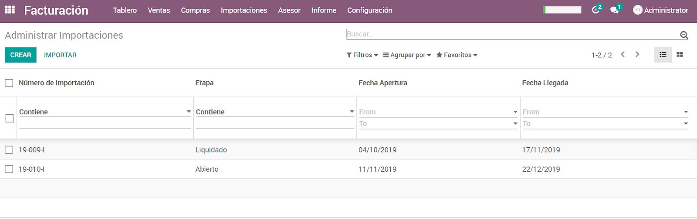
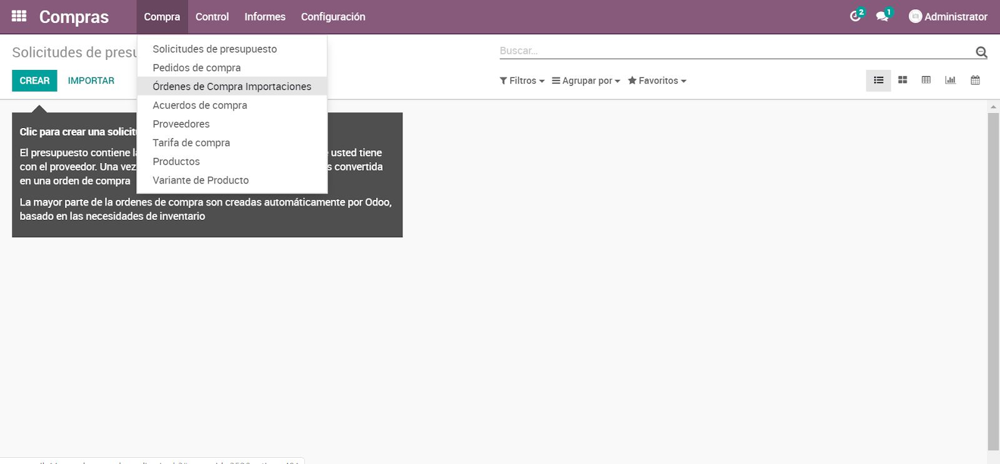
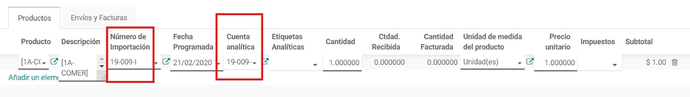
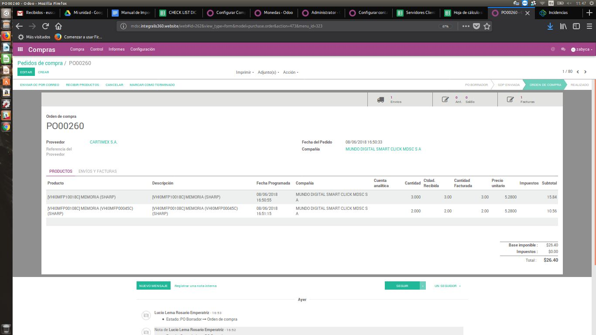
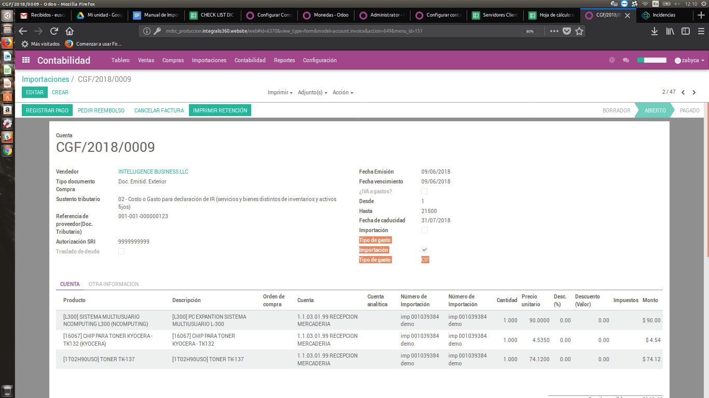
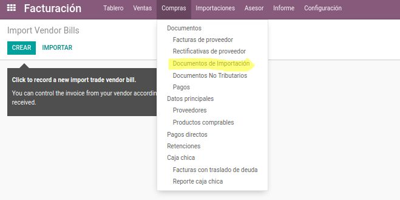
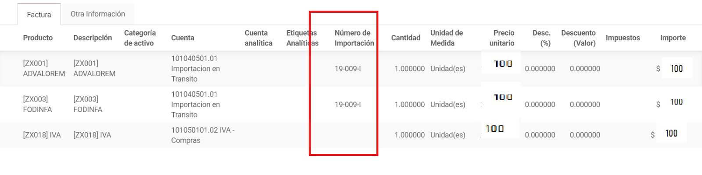
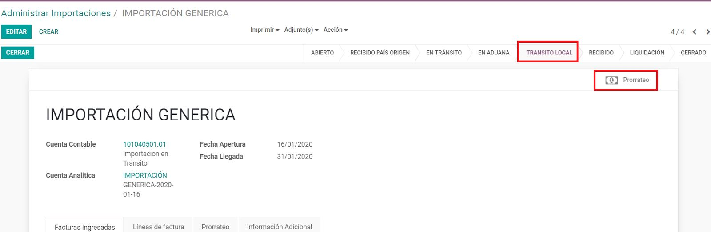
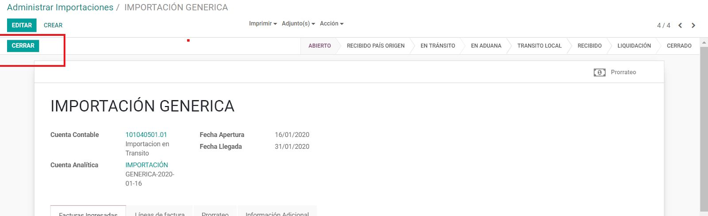

=======================
Manual de Importaciones
=======================

El siguiente instructivo es direccionado a la importación de productos, que permitirá realizar el proceso de registro, contabilización y liquidación de importaciones.

Previamente haber leido :doc:`../../crm/manual_de_compras/manual_de_compras`.

1. Tarjeta de Importación
=========================

Crear la liquidación de importaciones, ir a: :menuselection:`Módulo de Facturación --> Importaciones --> Tarjetas de Importación --> Crear --> Ingresar información --> Guardar`

.. nota::
    Al ingresar la información en la liquidación se debe tomar en cuenta llenar los campos: **Cuenta contable liquidación** ​ . ​ Está cuentas servirán para la contabilización de la importación

2. Orden de Compra Importación
==============================

Registrar el pedido de importación, ir a: :menuselection:`Módulo de Compras --> Compra --> Ordenes de compra importaciones --> Crear -->  Ingresar información --> Confirmar.` 

.. note::
    Ingresar la información recordando que en cada línea de la orden de importación debe tener asignado el número de importación respectivo. 

3. Facturas de Costo
====================

Después de crear la orden de compra, realizar el registro de todas las facturas que incurren en la **Orden de Compra Importación**, mediante el ícono: **Facturas** que se encuentra en la orden de compra.

.. note::
    Crearlas desde esta dirección le da al sistema información para la futura liquidación de importación. 
    Al registrar las facturas se debe tomar en cuenta la importancia de ingresar el **Número de Importación** en cada una de las líneas de factura y el **tipo de gasto**, al igual de marcar la factura como **Importación** 

**Contabilización**
-------------------

Al momento de marcar la factura como **Importación**, el sistema cambia la cuenta de gasto registrada en la categoría del producto y asigna la cuenta **Importaciones en tránsito**.

+--------------------------+-------------------+------------------+
|   Cuenta Contable        |      DEBE         |    HABER         |
+==========================+===================+==================+
|Importaciones en tránsito |     100           |                  |
+--------------------------+-------------------+------------------+
|PROVEEDORES (CXP)         |                   |     100          |
+--------------------------+-------------------+------------------+

.. note::
    Este registro contable es por cada factura registrada.

4. Facturas de Seguro y Flete
=============================

Después de crear la orden de compra, realizar el registro de todas las facturas que incurren en la

importación en el :menuselection:`Módulo de Facturación --> Compras -->Documentos de Importación`

.. note::
    Crearlas desde esta dirección le da al sistema información para la futura liquidación de importación. 

Al registrar las facturas se debe tomar en cuenta la importancia de ingresar el **Número de Importación** en cada una de las líneas de factura y el **tipo de gasto**, al igual de marcar la factura como **Importación**. 

**Contabilización**
-------------------

Al momento de marcar la factura como **Importación**, el sistema cambia la cuenta de gasto registrada en la categoría del producto y asigna la cuenta **Importaciones en tránsito**

+--------------------------+-------------------+------------------+
|   Cuenta Contable        |      DEBE         |    HABER         |
+==========================+===================+==================+
|Importaciones en tránsito |     100           |                  |
+--------------------------+-------------------+------------------+
|PROVEEDORES (CXP)         |                   |     100          |
+--------------------------+-------------------+------------------+

5. Documento DAU
================

Después de crear la orden de compra, realizar el registro de todas las facturas que incurren en la
importación en el :menuselection:`Módulo de Facturación --> Compras --> Documentos de Importación`

.. note::

    Crearlas desde esta dirección le da al sistema información para la futura liquidación de importación. 

Al registrar las facturas se debe tomar en cuenta la importancia de ingresar el **Número de Importación** en cada una de las líneas de factura y el **tipo de gasto**, al igual de marcar la factura como **Importación** , excepto en la línea de Impuesto a la Renta ya que no se prorrateará en la importación , y se le dará un tratamiento contable diferente .

**Contabilización**
-------------------

Al momento de marcar la factura como **Importación**, el sistema cambia la cuenta de gasto registrada en la categoría del producto y asigna la cuenta **Importaciones en tránsito**

+--------------------------+-------------------+------------------+
|   Cuenta Contable        |      DEBE         |    HABER         |
+==========================+===================+==================+
|Importaciones en tránsito |     200           |                  |
+--------------------------+-------------------+------------------+
|IVA en Compras            |     100           |                  |
+--------------------------+-------------------+------------------+
|PROVEEDORES (CXP)         |                   |     300          |
+--------------------------+-------------------+------------------+

6. Prorrateo de Productos
=========================

Después de registrar los documentos de importación, ir a la tarjeta de importación, en la siguiente dirección:

:menuselection:`Facturación --> Importaciones --> Tarjetas de importación --> Seleccionar la importación respectiva --> ingresar`

- Click en el icono Prorrateo. 

Revisar el prorrateo calculado en la pestana **Prorrateo**

A continuación dejar la tarjeta de importación en estado **Tránsito Local**.

7. Recepción de Mercadería
==========================

Una vez la mercadería llegue y tomando en cuenta que el estado de la importación está en **Tránsito Local** se debe realizar la recepción en la siguiente dirección: 

:menuselection:`Módulo de Compras --> Compra --> Orden de compra importación --> Identificar la orden de importación respectiva --> Abrir orden  -->`   ícono **Envíos**

En esa ventana se debe registrar las cantidades recibidas para después dar click en el botón **Validar**

Al validar el movimiento, el sistema va y revisa el prorrateo de costos en la importación y realiza el asiento contable con el valor que se encuentra en el prorrateo, cambiando así el valor que esté en la orden de importación.

Una segunda opción de recepción es :menuselection:`Módulo de inventario --> Recepciones`

**Contabilización**
-------------------

+--------------------------+-------------------+------------------+
|   Cuenta Contable        |      DEBE         |    HABER         |
+==========================+===================+==================+
|Inventario                |     400           |                  |
+--------------------------+-------------------+------------------+
|Importaciones en tránsito |                   |     400          |
+--------------------------+-------------------+------------------+

8. Finalizar Importación
========================

Para finalizar, ir a la tarjeta de importación en la siguiente dirección:
:menuselection:`Facturación --> Importaciones --> Tarjetas de importación --> Seleccionar la importación respectiva --> ingresar -->` dejar la tarjeta de importación en estado **Cerrado**.

