====================
Manual de Producción
====================

**Previamente**

-Lista de Materiales 

1. ORDEN DE PRODUCCION
======================

1.1 Crear
---------

Ir a: :menuselection:`Módulo de Fabricación --> Operaciones --> Ordenes de Produccion --> Crear --> Ingresar los datos --> Grabar`

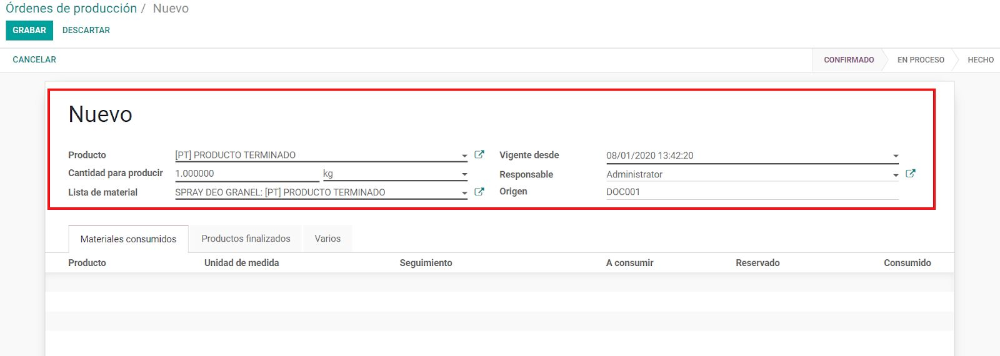

:menuselection:`-->` Varios

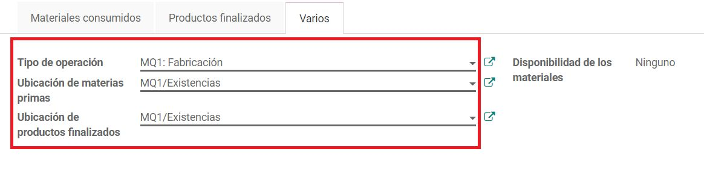

:menuselection:`-->` Elegir Tipo de Operación

.. note::
    Elegir la bodega desde la cual se realizar la operacion , debe ser la misma que la de donde tomará las materias primas tomando en cuenta esté seguida de: **Fabricación**

:menuselection:`-->` Elegir Ubicación de materias primas

.. note:: 
    Esto predetermina desde que bodega se tomarán las materias primas, se deberá elegir la bodega que esté seguida de **/Existencias**.

:menuselection:`-->` Elegir Ubicación de productos finalizados.

.. note:: 
    Esto predetermina en que bodega se recibirán los productos finalizados , se deberá elegir la bodega que esté seguida de **/Existencias**

:menuselection:`-->` Pulsar **GRABAR**

.. note:: 
    En este punto el sistema calcula cantidades y está a espera de confirmar exista disponibilidad de productos

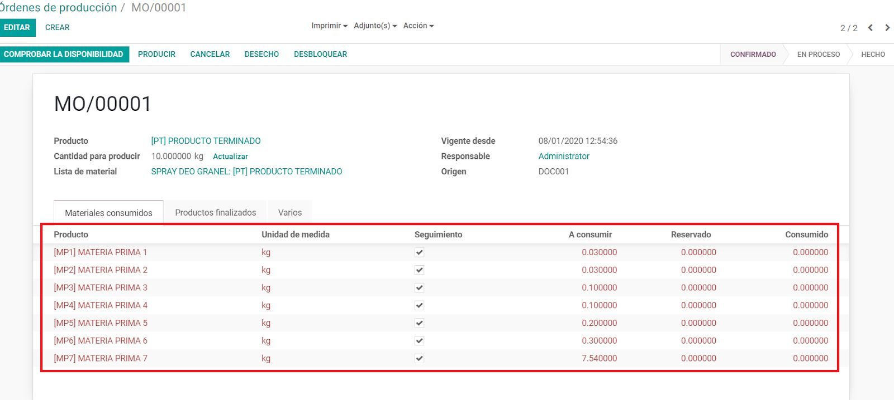

1.2 Reservar
------------

:menuselection:`Desbloquear --> EDITAR --> Click sobre el producto en la lista de materiales -->` Elegir **Lote** :menuselection:`-->` **GRABAR**

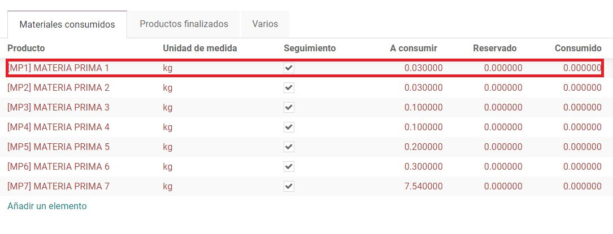

Elegir **Lote** y la cantidad correspondiente en **Realizado** de cada producto :menuselection:`-->GRABAR`

.. note:: Se puede elegir varios lotes

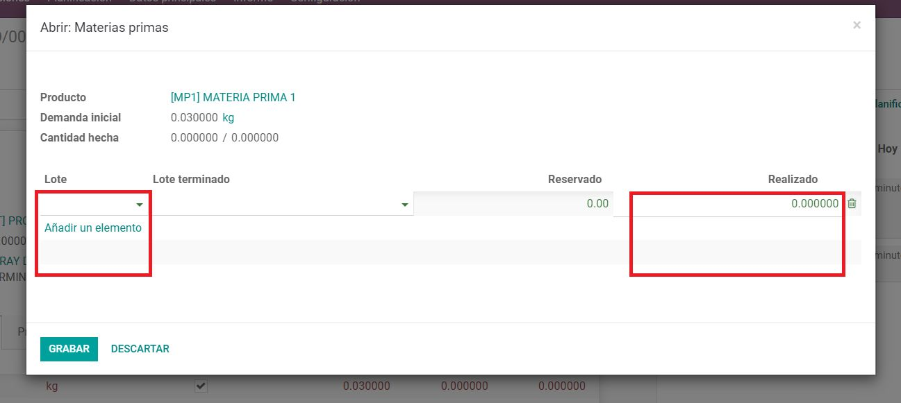

:menuselection:`-->GRABAR --> BLOQUEAR`

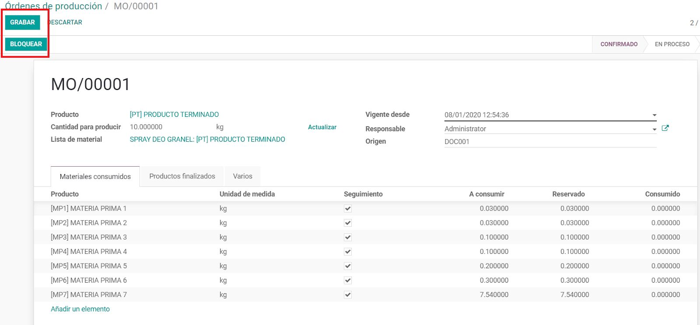

Pulsar **COMPROBAR DISPONIBILIDAD**

.. note::
    Los productos de los cuales exista disponibilidad se pintaran de color negro, adicional esta acción reserva la materia prima a utilizar, cuando todos los productos tengan disponibilidad se habilita el botón **PRODUCIR**.

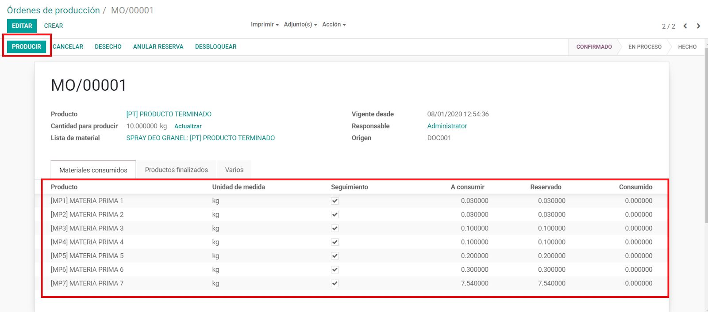

1.3 Terminar
------------

Pulse **Producir**

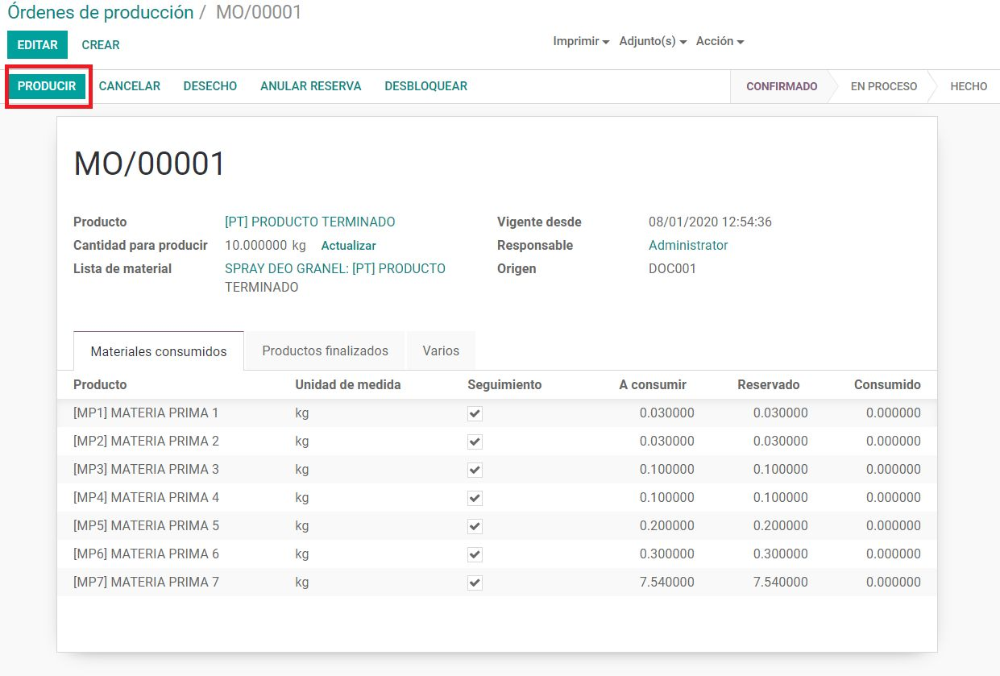

Crear y Editar el Lote de los nuevos productos

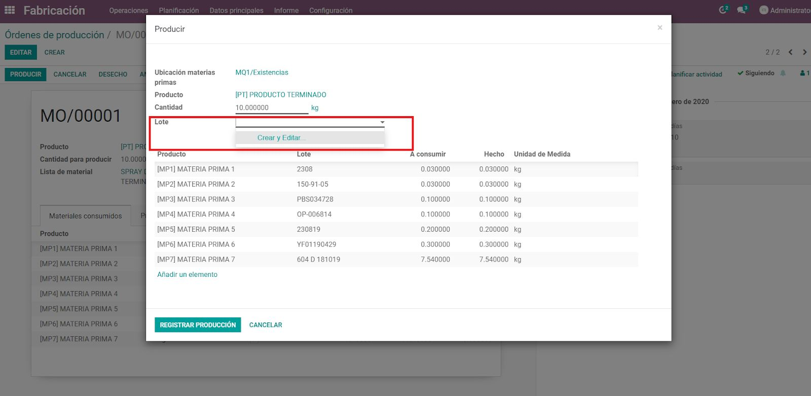

:menuselection:`-->` De ser el caso editar **Cantidad** de productos terminados (Se produjo más o menos de lo esperado)

:menuselection:`-->` De ser el caso editar **Hecho** de productos utilizados (Se utilizó más o menos de lo esperado)

:menuselection:`-->` De ser el caso editar **Añadir un elemento** de productos utilizados extra (Se utilizaron productos diferentes en la producción)

:menuselection:`-->` Pulsar **REGISTRAR PRODUCCION**

:menuselection:`-->` Pulsar **MARCAR COMO HECHO**

.. note::
    En este punto se termina la producción y se carga el inventario.

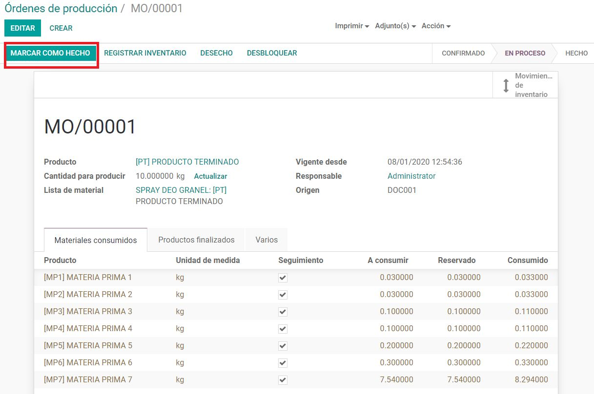

1.4 Desechos
------------

Antes de **MARCAR COMO HECHO** de ser el caso que se daño algún insumo dentro de la receta del producto y se va a cargar al costo de la producción 

:menuselection:`-->` Pulsar **DESECHO**

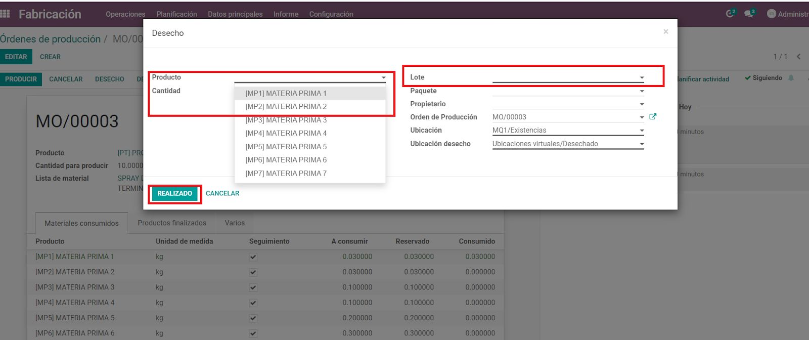

:menuselection:`-->` Agregar los datos señalados

:menuselection:`-->` Pulsar **REALIZADO**

:menuselection:`-->` Continuar Proceso

.. note::
    En este punto se dio de baja los insumos seleccionados
