================
Manual de Ventas
================

1. COTIZACIÓN DE VENTA
======================

Ir a: :menuselection:`Ventas --> Ventas --> Cotización --> Crear --> Ingresar los datos --> Guardar`

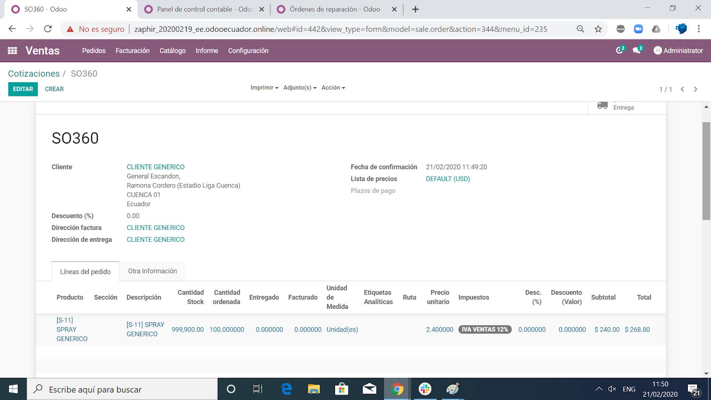

Agregar desde que bodega se tomarán los productos a vender

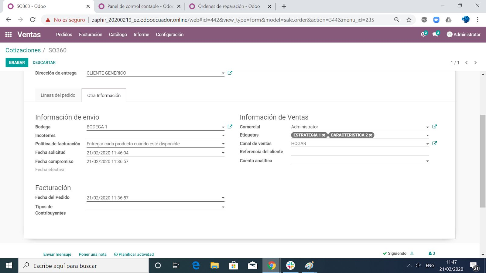

:menuselection:`-->` Pulsar **CONFIRMAR VENTA**

.. note::
    En este punto, la cotización se a convertido en un **Pedido de Venta**

2. PEDIDO DE VENTA
==================

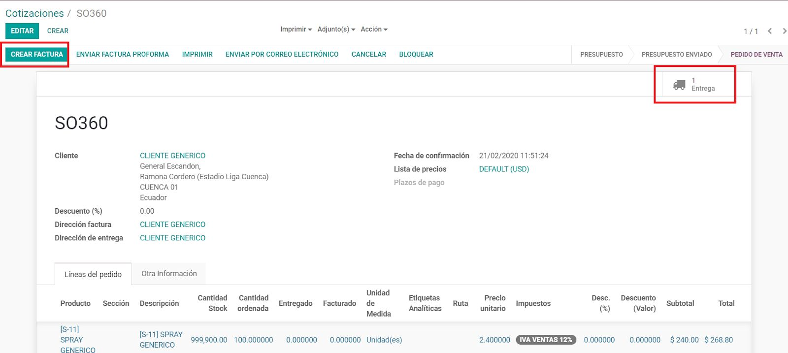

.. note::
    Desde el Pedido de Venta se accede a **Envíos** de Inventario y **Facturas**

2.1 Factura de Venta
--------------------
:menuselection:`Crear Factura --> VALIDAR`.

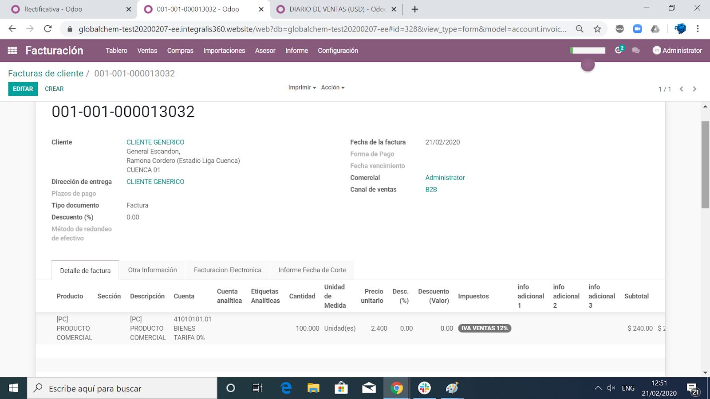

.. note::
    Al validar, se genera la factura electrónica, de acuerdo a la numeración del contador, previamente configurado.

2.2 Entrega de Inventario
-------------------------

:menuselection:`Módulo de Inventario --> Despacho de Órdenes --> Elegir Despacho --> Ingresar el lote y las cantidades de la Entrega --> CONFIRMAR -->` Pulsar **VALIDAR**

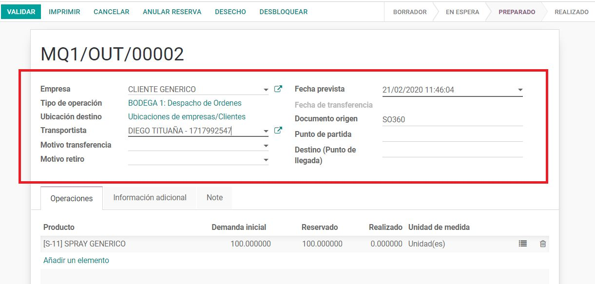
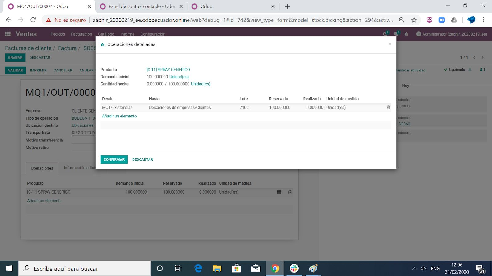

3. REGISTRO DE COBRO
====================

En la Factura pulsar en: :menuselection:`REGISTRAR PAGO -->` Seleccionar el **Método de pago** previamente creado en **Diarios** ( De esta manera se ingresan las retenciones del comprador, con un diario previamente configurado ) :menuselection:`-->Ingresar los demás datos --> Validar`

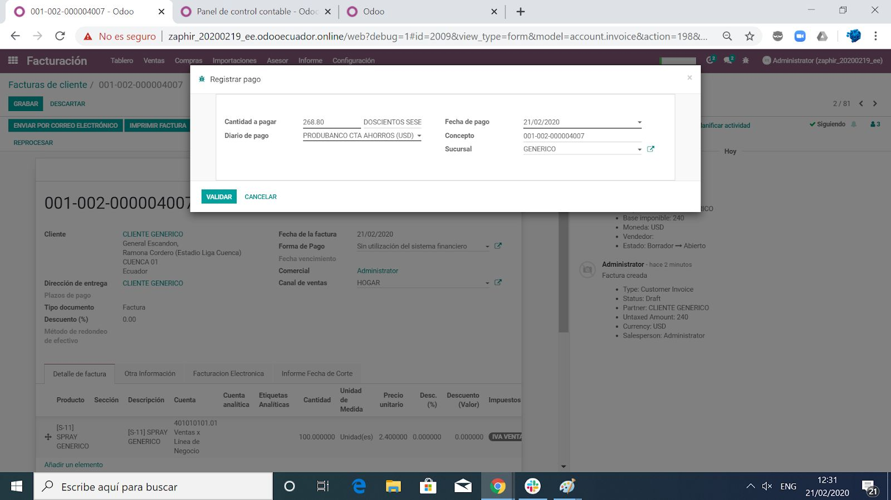

Se genera un Ingreso automático de acuerdo a la información del pago

Se cruza de forma automática el pago con la factura

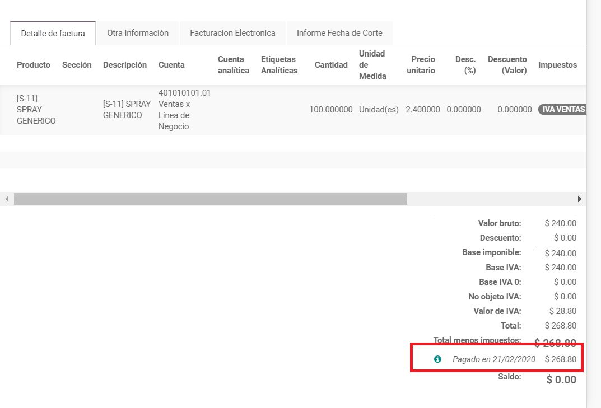

4. NOTA DE CRÉDITO
==================

4.1 Nota de Crédito
-------------------

En la Factura pulsar en :menuselection:`EMITIR RECTIFICATIVA -->`
Seleccionar **Método de Abono** (Crear un borrador de rectificativa)  :menuselection:`--> Escribir Motivo , Fecha de abono -->` Pulsar **CREAR NOTA DE CREDITO**

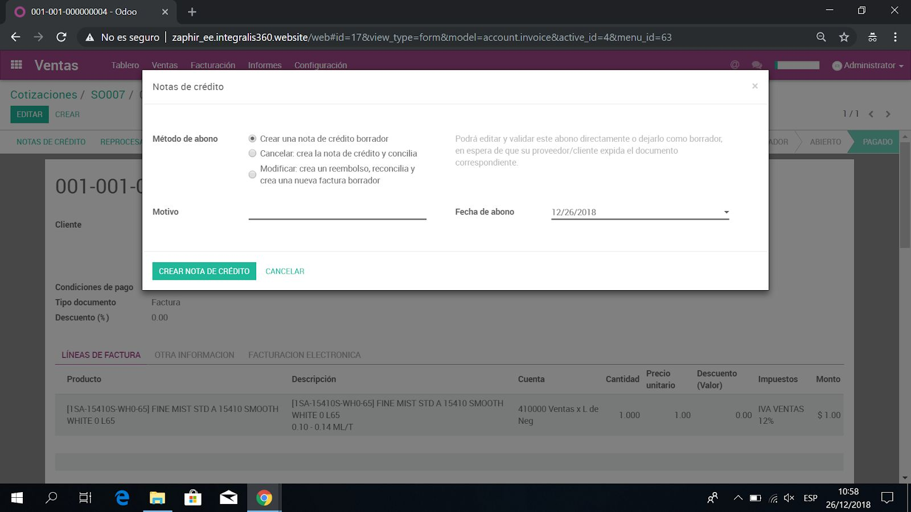

:menuselection:`Editar e Ingresar los datos de la nota de crédito --> Guardar --> Validar`

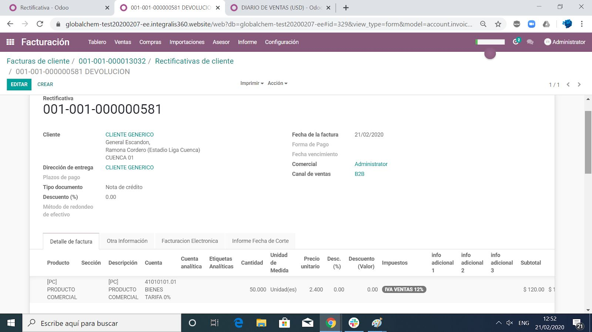

4.2 Cruzar Nota de Crédito con Factura (Solo si es requerido)
-------------------------------------------------------------

:menuselection:`Ingresar en Nota de Crédito --> Click sobre el Cliente -->` Pulsar **Conciliar Pagos** :menuselection:`-->` Pulsar **+** sobre la factura y nota de crédito que se busca conciliar

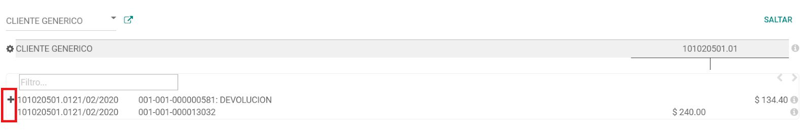
   
Pulsar **Conciliar**

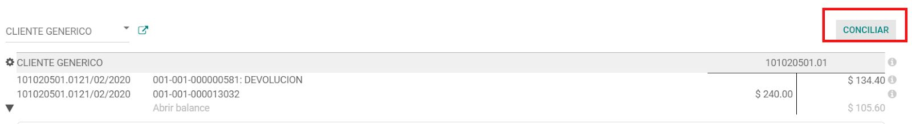

4.3 Devolución de Stock
-----------------------

En la Orden de Venta :menuselection:`Ingresar a la Entrega realizada -->` Pulsar **Devolver** :menuselection:`Ingresar la cantidad regresada -->` Pulsar **Devolver** :menuselection:`-->` Se genera un nuevo documento de recepción :menuselection:`-->` Ingresar el lote y las cantidades de la Recepción :menuselection:`-->` Pulsar **Validar**

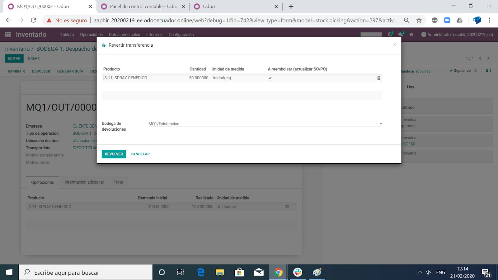
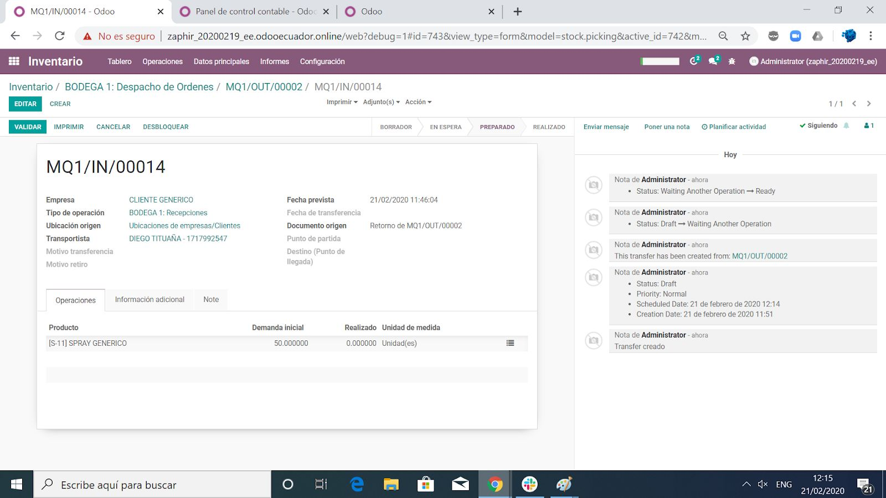
   