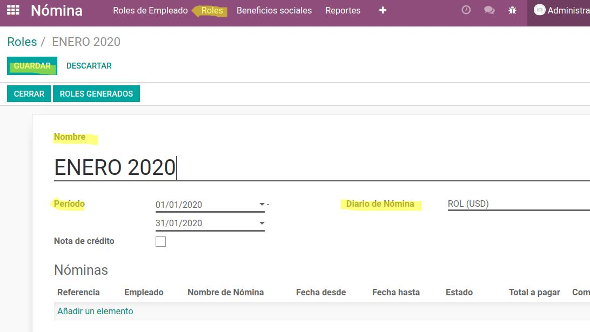
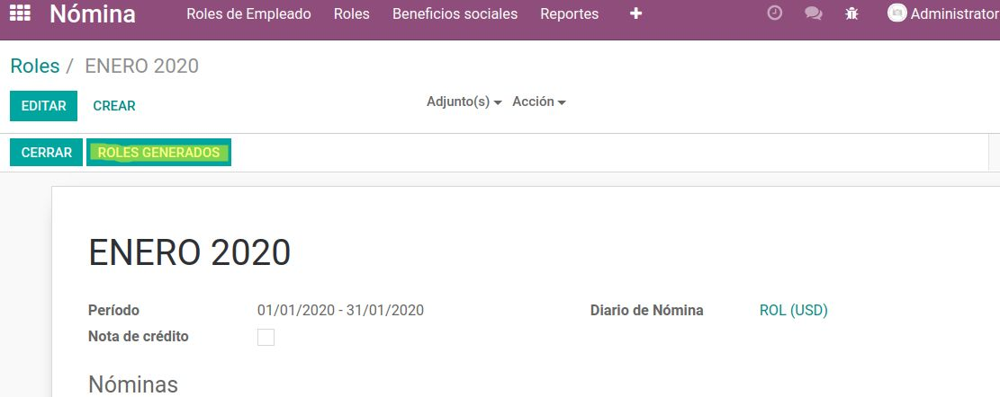
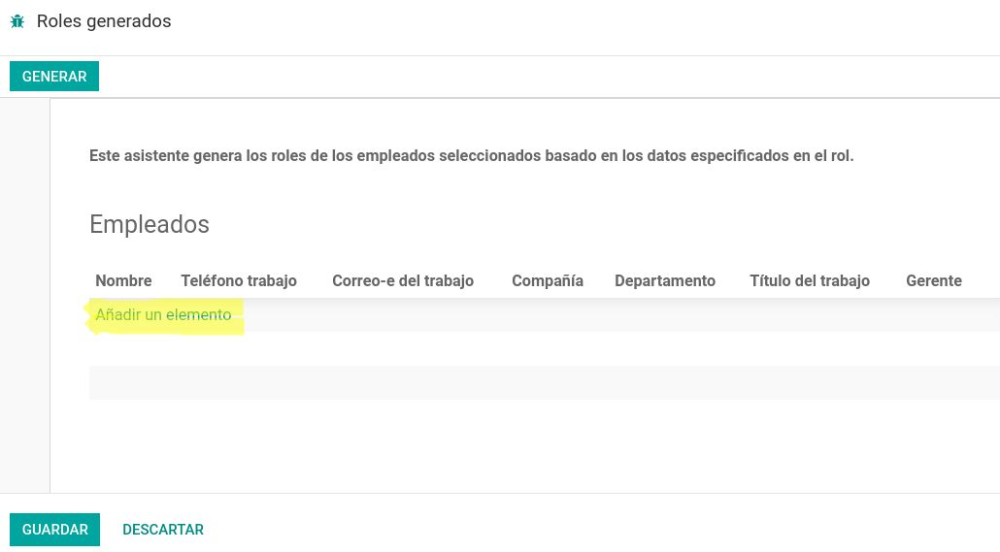
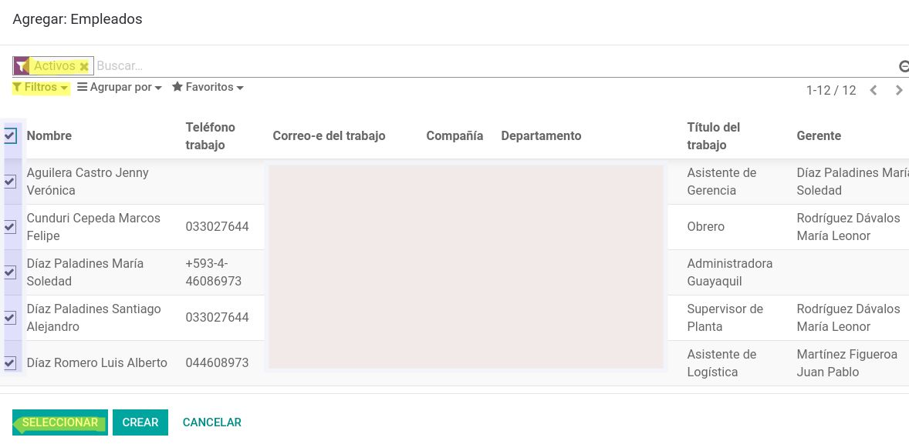
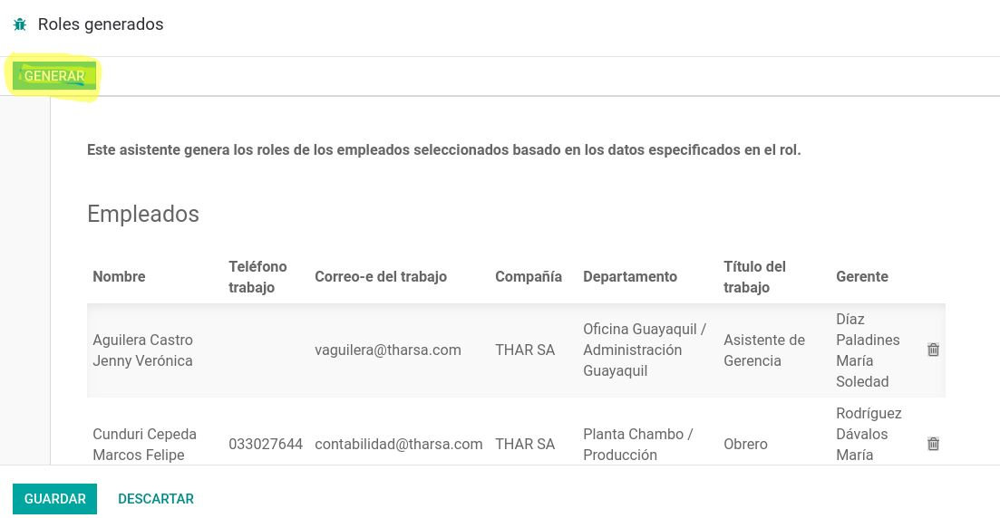
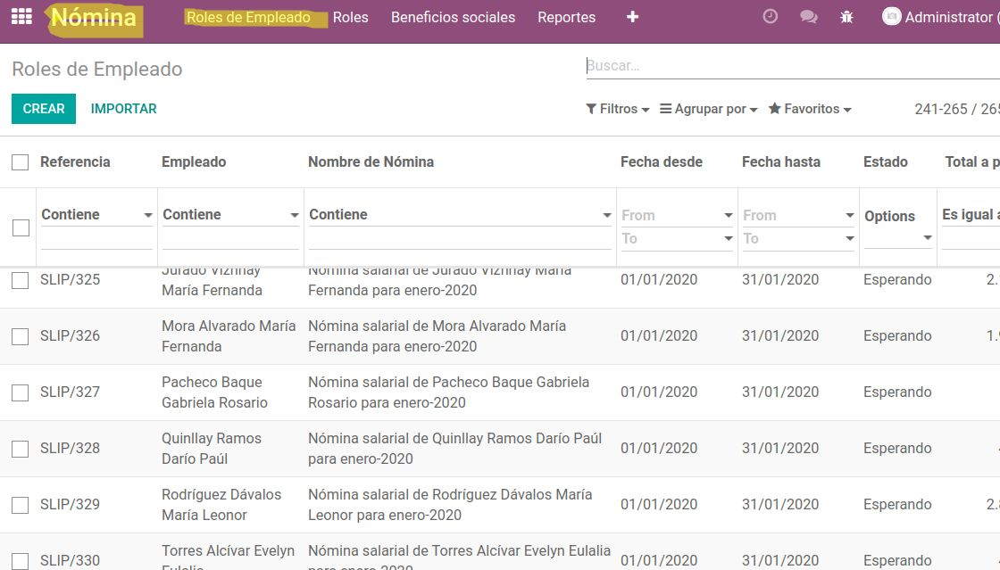
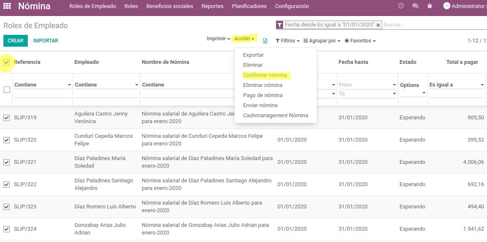
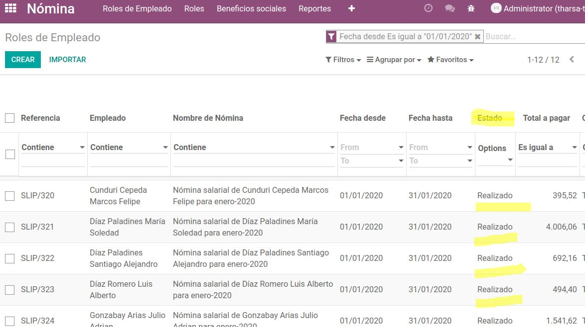
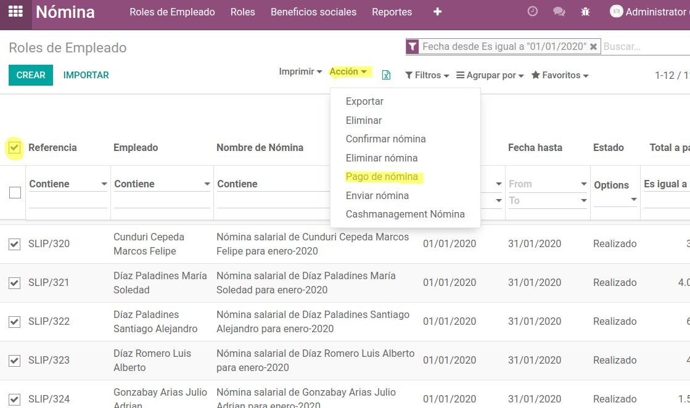
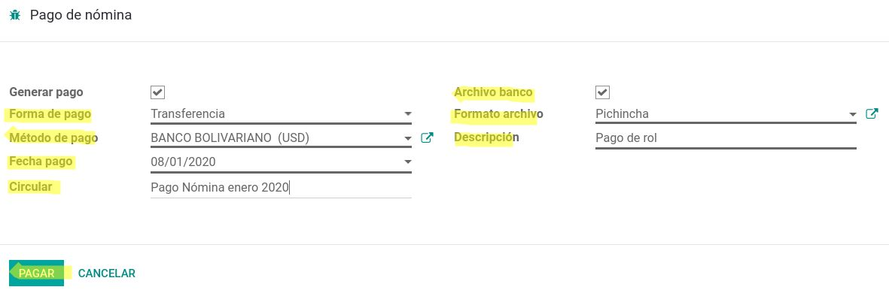

=============
Manual Nómina
=============

El siguiente instructivo es direccionado a la generación, cálculo, contabilización, y pago de la nómina de empleados, culminando con la generación de archivo cash management.

Para realizarlo, seguir los siguientes pasos:

1. Generación y Cálculo
=======================

Para la generación y cálculo de la nómina de empleados ir a la siguiente dirección:

:menuselection:`Módulo de Nómina --> Roles --> Crear --> Ubicar el nombre, fechas de cálculo, diarios --> Guardar.`

Después de guardar la ficha de generación: 

Dar click en el botón **Roles Generados**, donde se despliega una ventana en la cual dar click en **Añadir un elemento**.

Se despliega otra ventana, donde se debe filtrar solo los empleados activos, marcar todos los registros, a continuación el botón **Seleccionar** y finalmente el botón **Generar**

.. note:: 
    Una vez el proceso haya terminado, se puede visualizar el listado de las nóminas en estado **Esperando** en la siguiente dirección:

:menuselection:`Módulo de Nómina --> Roles de Empleado.(Verificación de valores)`

2. Contabilización
==================

Una vez se haya realizado la revisión de datos, se procede a realizar la contabilización de las nóminas siguiendo los siguientes pasos:

:menuselection:`-->` Marcar todos los registros

:menuselection:`-->`  Ir al botón **Acción**, opción **Confirmar nómina**

.. note::
    Al término del proceso, los registros de nómina cambian a estado **Realizado**.

3. Pago de Nomina y Archivo Cash Management
===========================================

Después de contabilizar, se procede a realizar el pago de las nóminas siguiendo los siguientes pasos: 

:menuselection:`Marcar todos los registros -->` Ir al botón **Acción** :menuselection:`-->` Opción **Pago de nómina** :menuselection:`--> Ingresar los datos necesarios en la ventana que se despliega.`

.. note::
    Al dar click en el botón **PAGAR** se descarga el archivo plano para importación al banco y se generan los egresos.