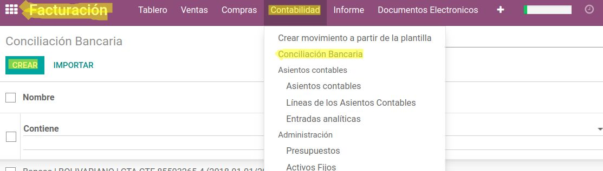
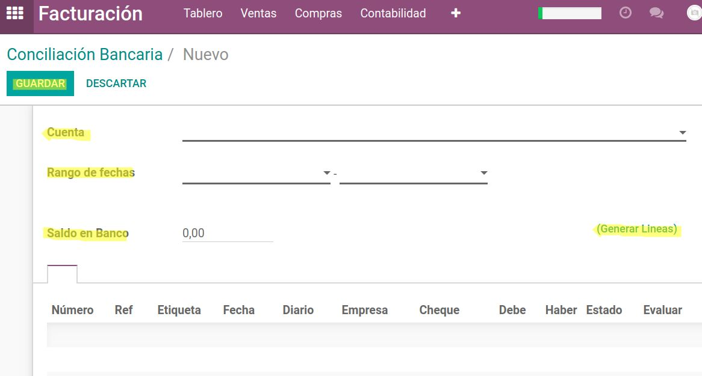
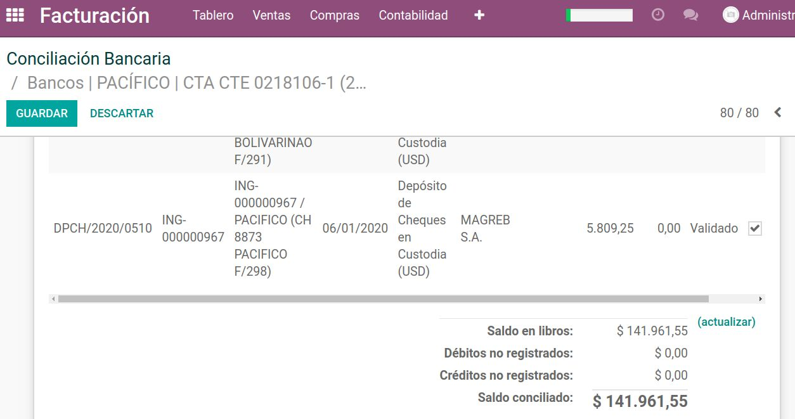
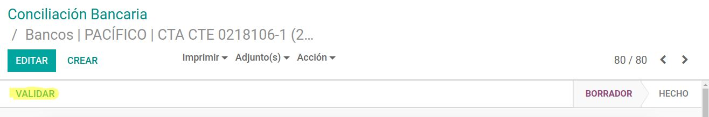
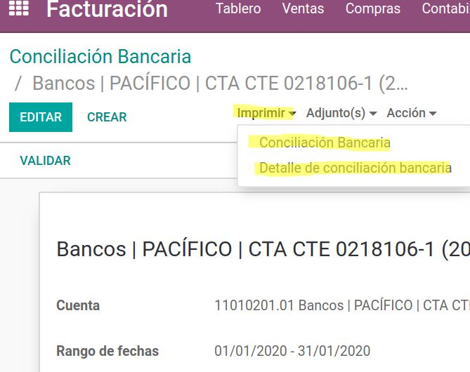
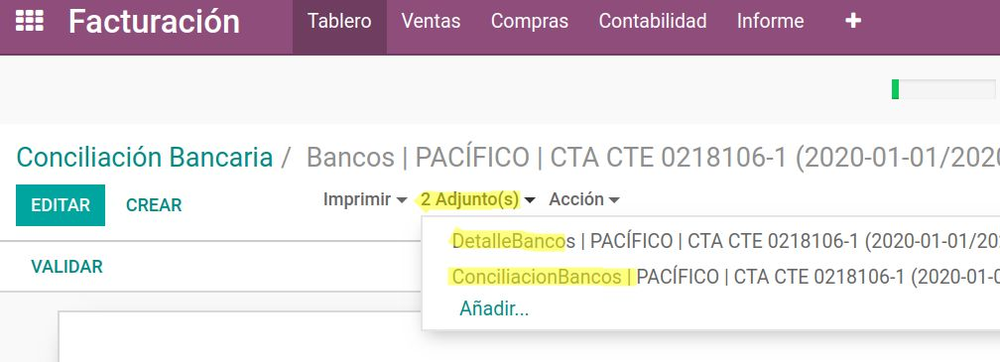

====================================
Manual para La Conciliación Bancaria
====================================

1.- En **Contabilidad**, escoger **Conciliación Bancaria** y dar click en el botón **Crear**.

2.- Escoger una de las Cuentas Bancarias, determinar el mes a conciliar (rango desde y hasta), colocar el **Saldo de Bancos** del Estado Banciario y dar click en **Generar líneas**” (botón en azul, debajo del Saldo en Bancos). 

.. note:: Esto desplegará todos los movimiento de la cuenta a conciliar.

3.- Realizar la revisión a detalle tanto del Estado Bancario vs el Sistema. Comparar los movimientos (el sistema en la columna Evaluar, está marcado en todo el listado). Se debe determinar cada movimiento y desmarcar si corresponde a un egreso que no considere el Banco; o si el Banco contiene algún movimiento que en el sistema no se encuentra, se debe registrar en el sistema y volver a refrescar la conciliación **Generar líneas**.

(El sistema recordará las partidas marcadas y desmarcadas).

4.- Una vez conciliado (Diferencia = 0) podemos guardar la conciliación en estado Borrador y a su vez confirmado el proceso, se debe Validar.

5.- El proceso cuenta con el control que alertar si existe movimiento que no estén validados. De ser el caso se tendrá que ir a la transacción a validar y nuevamente refrescar la conciliación.

6.- Una vez grabado y validado, se procede a generar los documentos de respaldo en el botón imprimir el cual genera la conciliaciòn Bancaria (detalle de todas las partidas conciliatorias a cruzarse en los meses posteriores) y el Detalle de la conciliación bancaria.

(Enlista todas las partidas que fueron cruzadas en la conciliación actual.)

7.- Seguir realizando las conciliaciones mes a mes de la cuenta (El sistema reconocerà la ùltima conciliación), esto repetirlo por cada cuenta bancaria. 

.. note:: Tomar en consideración que una vez conciliado hasta una fecha, no se deberían mover las transacciones.

Si por algún motivo se tiene que realizar una corrección a una partida ya conciliada; es decir, al realizar un cambio a una factura o asiento (Cambio de estado, ejemplos: Romper conciliación, de Pagado hacía Abierto, de Abierto hacia Borrador, y viceversa). El sistema automáticamente desconcilia y se tendrá que realizar nuevamente la conciliación desde el mes que se hizo el cambio hacia adelante.