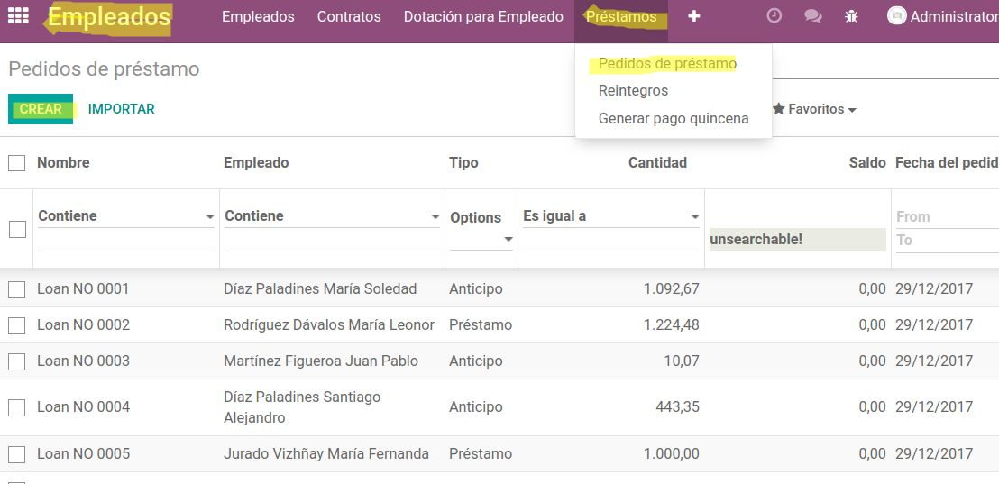
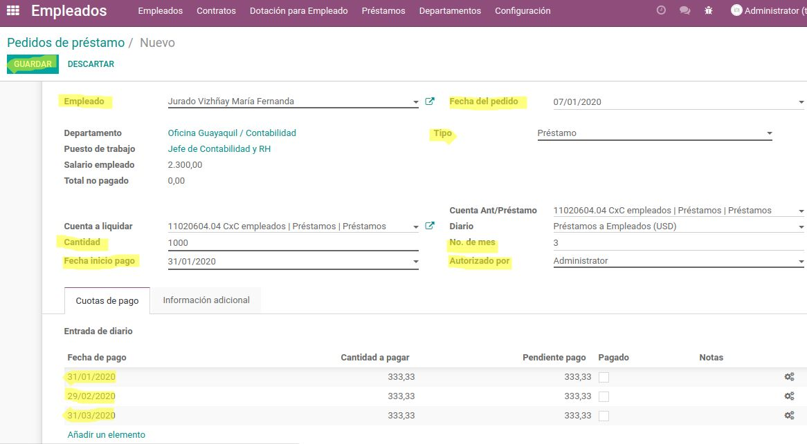

======================================
Manual Préstamos y Anticipos Empleados
======================================

El siguiente instructivo es direccionado a la generación, contabilización, y pago de préstamos y anticipos de empleados. 

Para realizarlo, seguir los siguientes pasos:

1. Generación
=============

Para la generación de préstamos y anticipo de empleados ir a la siguiente dirección:

:menuselection:`Módulo de Empleados --> Préstamos --> Pedidos de préstamo --> Crear.`

.. note::
    Al crear se debe ingresar la información necesaria, tomar en cuenta que en el campo **Tipo** se decide si es un préstamo o un anticipo, se finaliza la creación con el click en el botón **Guardar**

2. Contabilización
==================

Una vez se haya guardado la información registrada se procede a realizar la contabilización de las nóminas dando click en el botón **Aprobar**

.. image:: media/imgn03.png
   :align: center

3. Pago de Préstamo o Anticipo
==============================

Después de contabilizar, se procede a realizar el pago dando click en el botón **Acreditar**, donde se despliega una ventana para registro de información y finalmente Dar click en botón **Acreditar**

.. image:: media/imgn04.png
   :align: center