==========================================
Manual Registro de Retenciones de clientes
==========================================

El siguiente instructivo es direccionado al registro de retenciones realizadas por los clientes, y sean facturas generadas en la siguientes modalidades:

1. Facturas generadas desde el POS
==================================

1.1. Cuando el cliente genera la retención en el momento de la venta POS
------------------------------------------------------------------------

Se registra la retención, como un método de pago de POS.

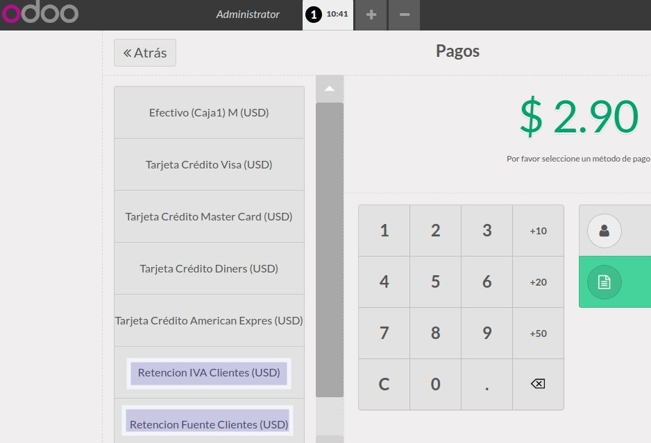

1.2. Cuando el cliente genera la retención días después de la venta POS
-----------------------------------------------------------------------

Como la caja y sesión de aquel día ya fueron validadas y cerradas. No se las puede modificar. En tanto es de la caja del día en la que el cliente entrega la retención donde el usuario debe entregar el dinero devuelta al cliente. Y los pasos a seguir son los siguientes:

1.2.1. DEVOLVER EL DINERO AL CLIENTE
~~~~~~~~~~~~~~~~~~~~~~~~~~~~~~~~~~~~

Al recibir la retención, el usuario debe entregar el dinero (valor) al cliente y debe hacerlo sacando el dinero de la caja así: 

Dirigirse a la sesión la cual está actualmente activa y abierta :menuselection:`-->` Dar click en la opción **Sacar Dinero** :menuselection:`-->` Se despliega una venta donde se ingresa la información (tomar en cuenta que en el motivo se debe ubicar el número de factura al cual afecta la retención) :menuselection:`-->` Sacar dinero. 

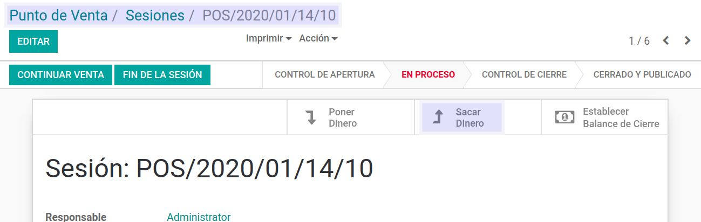

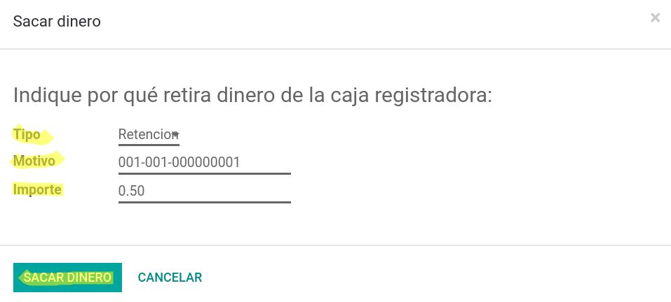

1.2.2. REGISTRAR LA RETENCIÓN EN LA FACTURA
~~~~~~~~~~~~~~~~~~~~~~~~~~~~~~~~~~~~~~~~~~~

Al recibir la retención, el usuario debe registrar la retención en la factura de venta así:

1.2.2.1. Dirigirse a la factura de venta respectiva.
****************************************************

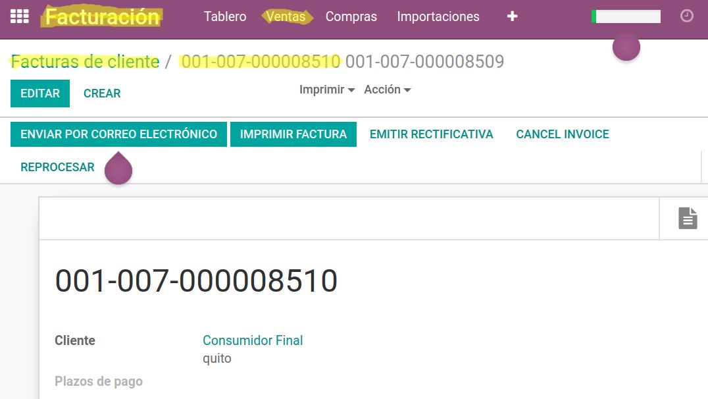

1.2.2.2. Ubicar el pago (copiar el número de pago) 
**************************************************

El número siempre es el segundo secuencial como se muestra en la imagen

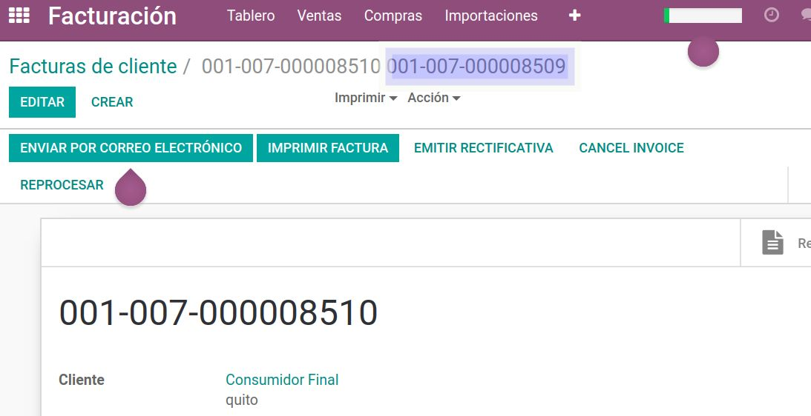

1.2.2.3. Desconciliar pago-factura 
**********************************

En la parte inferior de la factura podemos visualizar los pagos, para desconciliar dar click en el icono **i** y después en **DESCONCILIAR**

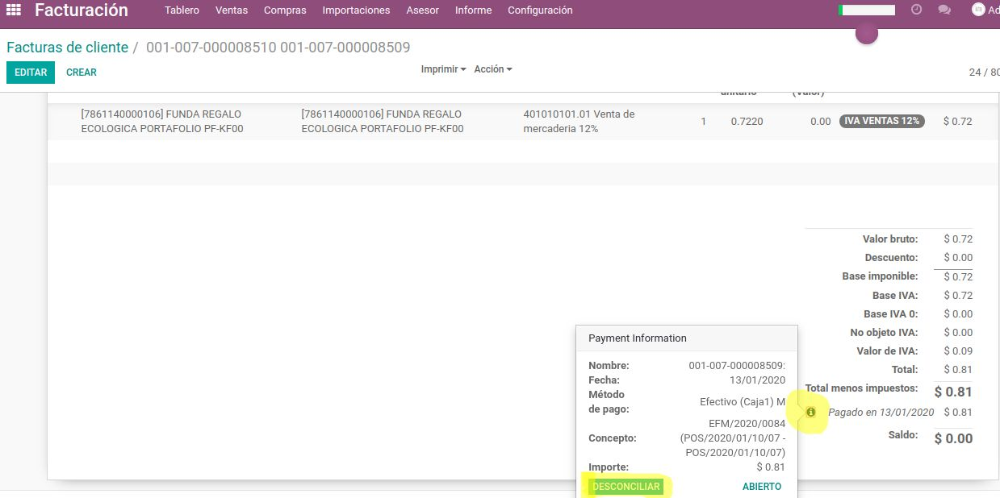

1.2.2.4. Ir al pago y cancelarlo 
********************************

Con el número de pago copiado, dirigirse a :menuselection:`Facturación --> Ventas --> Pagos --> Buscar el pago con el número copiado --> Ingresar al pago y dar click en Cambiar a borrador`

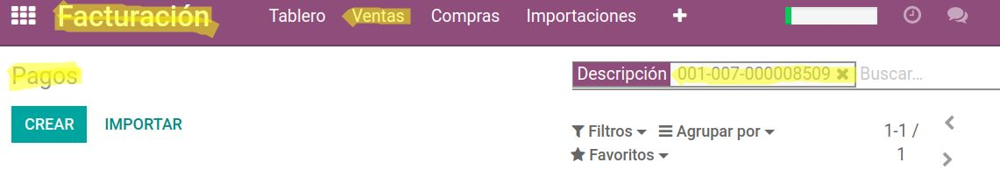

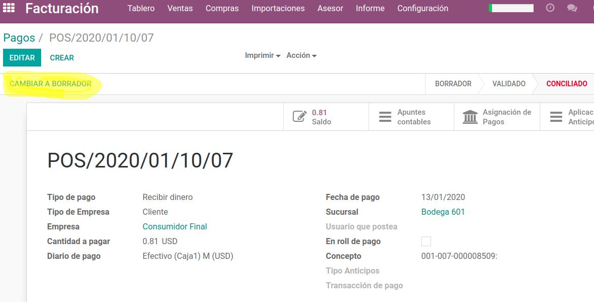

1.2.2.5. Dirigirse de nuevo a la factura respectiva para registrar la retención :menuselection:`-->` al ingresar a la factura, dar click en **RETENCIONES**
***********************************************************************************************************************************************************

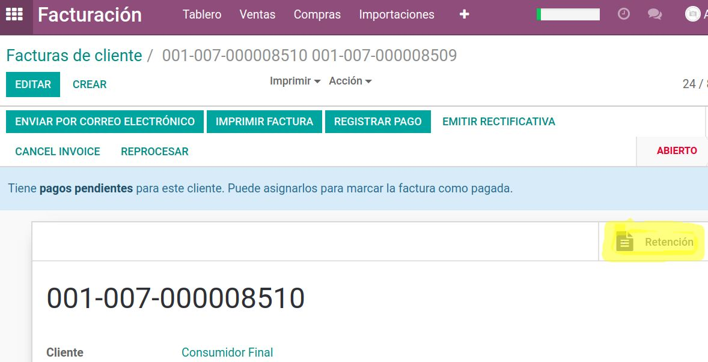
   
Se despliega una ventana donde se deben registrar los campos de la cabecera y dar click en añadir un elemento.

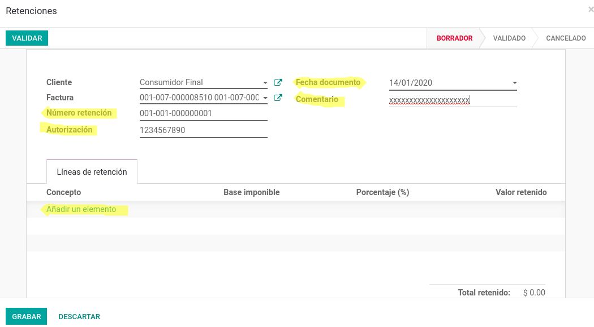

En añadir un elemento se debe seleccionar los impuestos respectivos para el registro de las retenciones :menuselection:`-->` Finalmente dar click en **GRABAR** y después en **VALIDAR**

.. image:: media/imagene11.png
   :align: center

1.2.2.6. Realizar el pago de la factura por la diferencia
*********************************************************

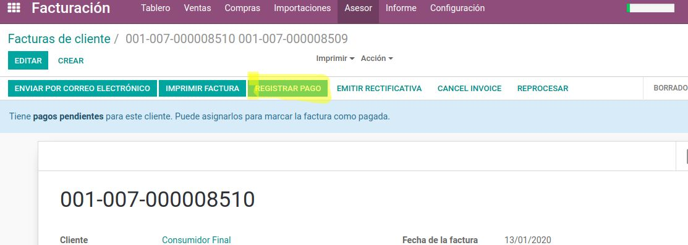

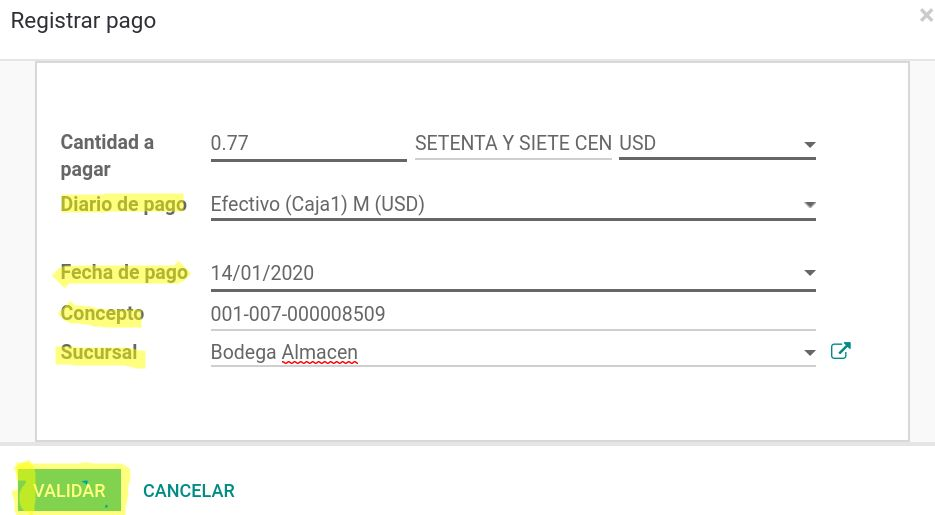

2. Facturas generadas desde el módulo de Ventas (al por mayor)
==============================================================

Al recibir la retención, el usuario debe registrar la retención en la factura de venta así:

Dirigirse a la factura respectiva para registrar la retención :menuselection:`-->` al ingresar a la factura, dar click en **RETENCIONES**

.. image:: media/imagene14.png
   :align: center

Se despliega una ventana donde se deben registrar los campos de la cabecera y dar click en añadir un elemento.

En añadir un elemento se debe seleccionar los impuestos respectivos para el registro de las retenciones :menuselection:`-->` Finalmente dar click en **GRABAR** y después en **VALIDAR**

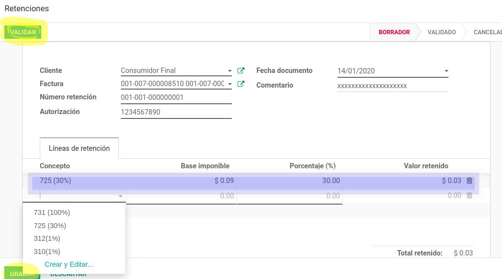